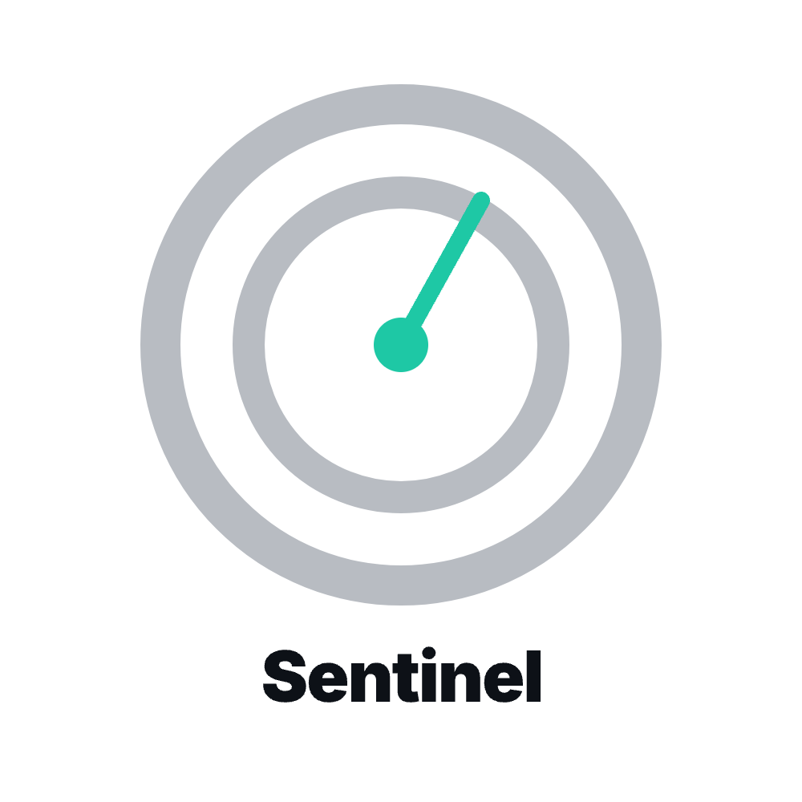

# CodeSentinel



CodeSentinel ayuda a equipos a adoptar Claude Code de forma segura. Observa sesiones de coding de miembros no técnicos, aplica políticas como "no tocar producción" o "no escribir secretos en el código", y muestra riesgos en un dashboard.

## Cómo funciona

Un CTO invita miembros no técnicos, los organiza en grupos y les comparte un comando de instalación para Claude Code. Ese comando conecta Claude Code con CodeSentinel y deja instalado un guard local que revisa las acciones antes de ejecutarlas.

```text
Miembro + Claude Code
        |
        | hooks: UserPromptSubmit + PreToolUse
        v
CodeSentinel
  - evalúa prompts antes del modelo
  - consulta políticas actuales por grupo
  - permite, pide aprobación o bloquea acciones
  - registra sesiones, riesgos y decisiones
        |
        v
Dashboard para CTO / seguridad
```

En prompts riesgosos, CodeSentinel puede inyectar contexto seguro para guiar al agente, sugerir una versión segura de la intención o bloquear la solicitud. En tool calls, el guard consulta las políticas vigentes del miembro antes de ejecutar y devuelve una decisión de permitir, pedir aprobación o denegar acciones como tocar producción o escribir secretos en el código.

## Qué incluye

- Dashboard de sesiones y eventos de Claude Code.
- Grupos y políticas para miembros no técnicos.
- Evaluación de prompts antes de enviarlos al agente.
- Guard live para tool calls usando las políticas actuales.
- Modo demo local sin Supabase.

## Correr localmente

```bash
npm install
npm run dev
```

La app corre en modo demo sin Supabase. Con Supabase y Anthropic configurados, habilita auth, persistencia, tokens por miembro y análisis de riesgo con IA.

## Stack

Next.js, React, TypeScript, Supabase y Anthropic Claude.

## Docs

Arquitectura, base de datos, auth, onboarding, políticas y deploy están en [`docs/`](docs/).

## Equipo

- Diego Lopez ([@dlopezvsr](https://github.com/dlopezvsr))
- Juan Manuel Hernández Pérez ([@jma-hdz](https://github.com/jma-hdz))
- Alejandro Maguey Rentería ([@alexmaguey](https://github.com/alexmaguey))
- Alden Myers ([@kaldenm](https://github.com/kaldenm))
